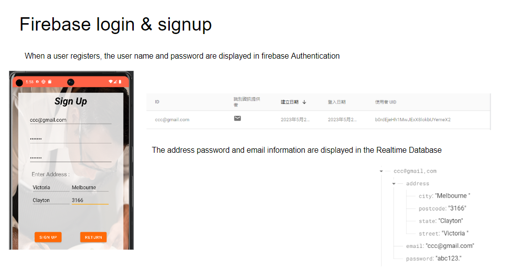
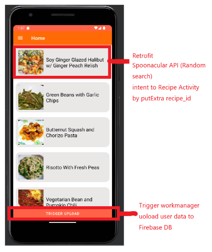
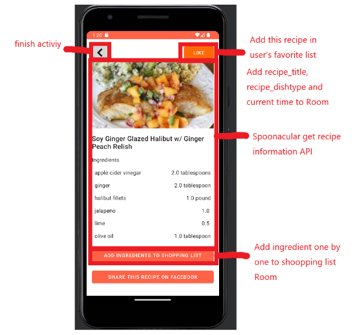
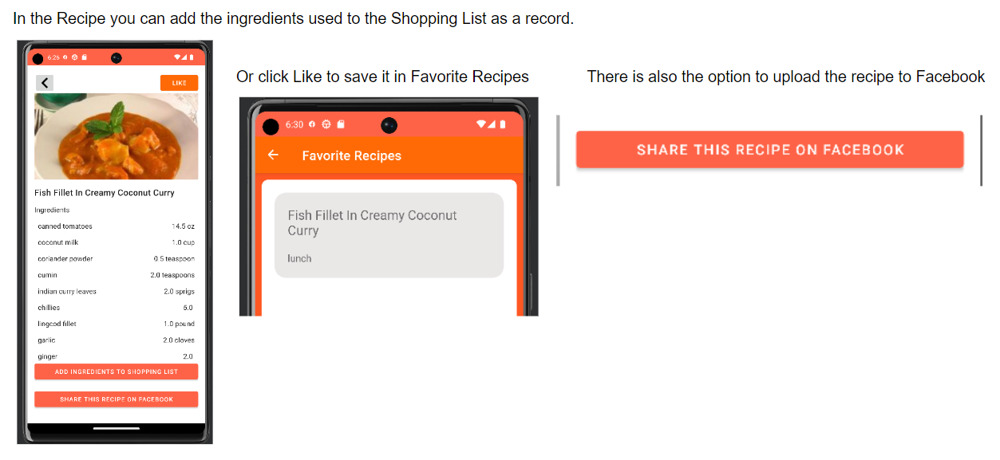
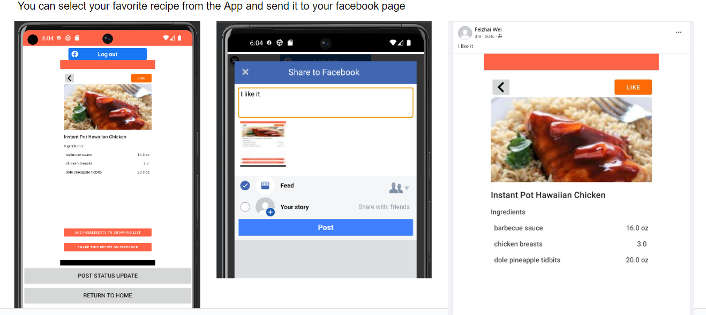
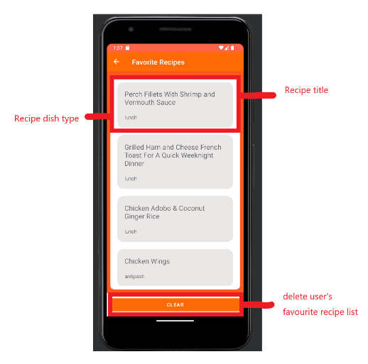
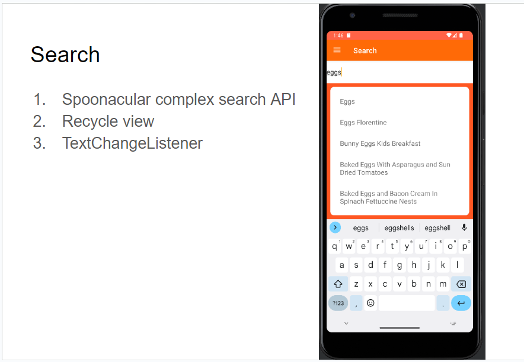
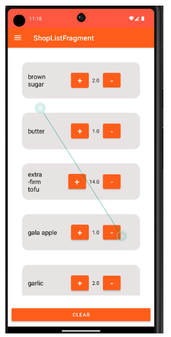
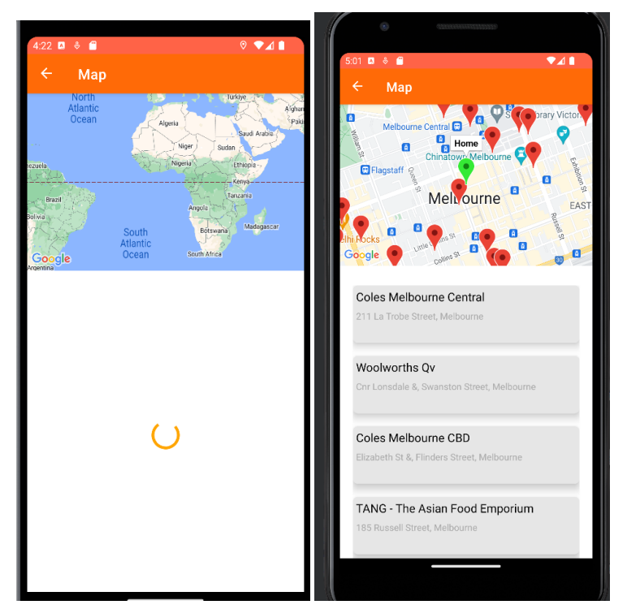
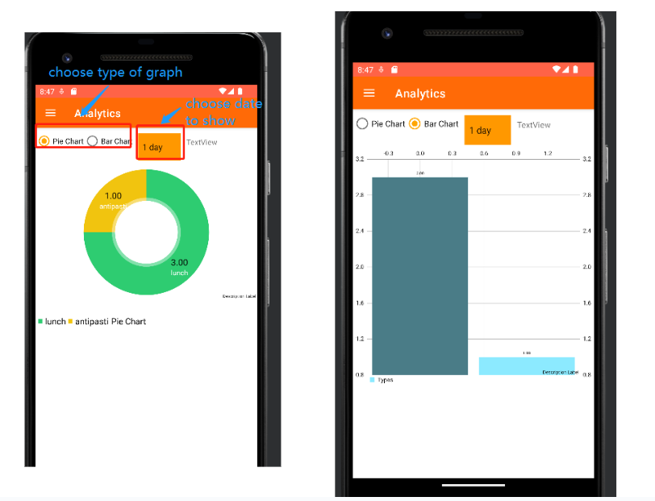

# LocalEats

## Project Overview
LocalEats is an innovative Android application designed to revolutionize the way food enthusiasts explore and prepare a variety of dishes. This app aims to provide a comprehensive culinary experience by offering features such as recipe discovery, cooking lessons, a supermarket finder, user profiles, shopping lists, diet structure analysis, and social media integration.

## Features

### Functionalities
1. **Recipe Discovery:** Browse and search through a vast collection of recipes with filters based on cuisine, dietary preferences, and ingredients. (Partially implemented)
2. **Cooking Lessons:** Access cooking tutorial videos from YouTube. (Not implemented)
3. **Supermarket Finder:** Locate the nearest supermarkets for ingredients. (Fully implemented)
4. **User Profiles:** Create profiles to save favorites, track cooking progress. (Partially implemented)
5. **Shopping List:** Add ingredients to a shopping list from recipes. (Fully implemented)
6. **Diet Structure Analysis:** Analyze diet patterns and provide insights. (Fully implemented)
7. **Social Media Sharing:** Share recipes on platforms like Facebook, Instagram, Twitter. (Partially implemented)

### New and Additional Features
1. User’s Favorite Recipe Screen
2. Spinner and Radio Buttons in Data Analysis Screen
3. Map Navigation in Main Screen Navigation Drawer
4. Mandatory Address Information for Signup

## Screenshots
1. Login & Sign up

2. Home

3. Recipe

4. Facebook

5. Favourite Recipes

6. Search

7. Shop List

8. Map

9. Analytic Report

## Public Web APIs
1. [Spoonacular API](https://api.spoonacular.com/)
2. [Google Maps API](https://www.google.com/maps/)
3. [Facebook Android SDK](https://developers.facebook.com/android/)

## Development Team
| Name | Contribution | Contribution Persentage
| --- | --- | --- |
| Shuhai Yu |  Screens(Home, Recipe, Shop List, Search, Favorite Recipes), Firebase Database, WorkManager background jobs | 40% |
| Junyi Chen | Screens(Login, Sign Up, ) | 20% |
| Minghao Tang | Screens(Map, Analysis Report), All UI Design | 20% |
| Xinchen Wei | Firebase Authentication, Facebook SDK | 20% |

## Demo Video

Made by Xinchen Wei